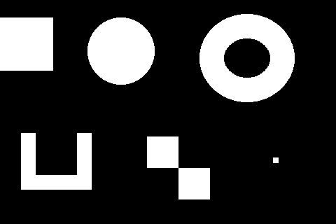
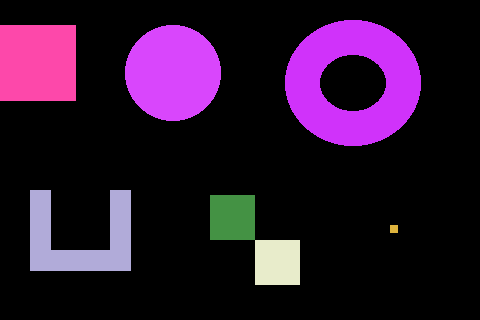

# Teste de componentes conectados

Execute na raiz do repositório (Python com Pillow instalado):

```powershell
python "Segunda Implementação - Rotulação/rotulacao.py"
```

O programa usa `imagem_componentes.png` e salva `resultado_componentes.png` nesta pasta. Também pode ser executado de dentro da pasta da implementação. Os arquivos anteriores `imagem_teste.png` e `resultado.png` foram preservados.

| Entrada binária | Componentes rotulados |
| --- | --- |
|  |  |

A entrada tem 480×320 pixels e sete componentes brancos sobre fundo preto:

- Um retângulo encostado na borda esquerda.
- Um círculo.
- Um anel: o buraco permanece preto e não cria outro componente.
- Uma forma em U: as hastes recebem rótulos provisórios diferentes e são unidas pela base.
- Dois quadrados que se tocam somente pela diagonal.
- Um quadrado pequeno isolado.

A implementação usa conectividade de quatro vizinhos. Por isso os dois quadrados diagonais recebem cores diferentes, totalizando **sete componentes**. Com oito vizinhos, seriam seis. As cores são sorteadas e podem mudar entre execuções.

Uma busca independente em largura confirmou os sete componentes, uma única cor por componente, cores distintas entre componentes e fundo preto preservado. Também foram conferidas imagens totalmente preta e branca, o limiar 127/128, pixels unidos somente pela diagonal e duas hastes unidas pela base. A execução foi validada tanto pela raiz quanto pela pasta da implementação.
