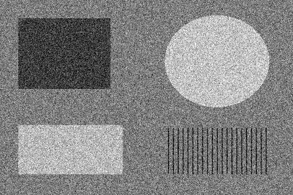
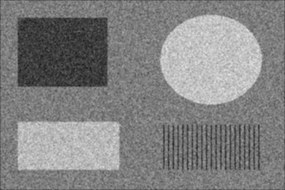

# Teste do filtro da média

Execute na raiz do repositório (Python com Pillow instalado):

```powershell
python "Sexta Implementação - Filtro da Média/filtro_media.py"
```

Pressione Enter para usar `imagem_ruido.png`. Também é possível informar o caminho de outra imagem; caminhos relativos são considerados a partir da pasta de execução. A saída é salva em `resultados/media.png`, dentro desta implementação, mesmo quando o programa é executado em outra pasta.

| Entrada com ruído | Média 3×3 |
| --- | --- |
|  |  |

A entrada sintética de 480×320 pixels contém regiões de cinza, figuras e linhas finas, com ruído gaussiano de desvio padrão 35 (semente 2409), limitado ao intervalo 0–255. Assim, a suavização aparece em toda a imagem, além do borramento das bordas e dos detalhes.

Na saída validada, 98,86% dos pixels mudaram. Na região uniforme interna do retângulo superior esquerdo (x de 45 a 164, y de 45 a 129), o desvio padrão caiu de 34,01 para 11,28. A faixa escura no limite externo é esperada pelo preenchimento com zeros fora da imagem.

A saída foi conferida pixel a pixel com uma soma independente das nove posições, usando padding de zeros e arredondamento. Também foram validados sete casos: imagem 1×1, branca, preta, uma linha, uma coluna, valores aleatórios e conversão de RGB para cinza. A execução foi conferida tanto pela raiz quanto pela pasta da implementação e com caminho informado contendo espaços e aspas.
